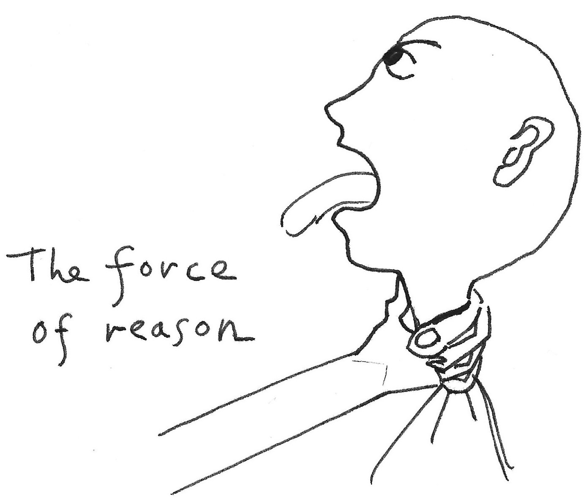
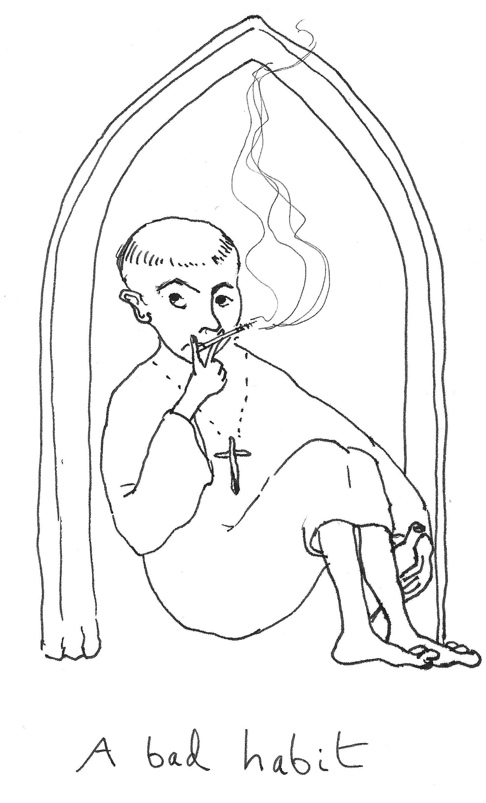

===============
Securing assent
===============

.. rubric:: From believable vision to wearable belief

One of your challenges is to be able to present a compelling and believable vision to your colleagues - to take it to them. The next is to bring them over, so that they don't just see it, but feel they can share it too.

**Your vision, however beautiful, will be quite useless if you're the only one who believes in it.**

*Securing assent* is a quite different kind of communication from sharing a vision a vision. That is something like broadcasting. Securing assent by contrast is a two-way transaction - an exchange.

How belief works
================

We invest a vast amount of intellectual energy in the ideas that we think deserve it, to make them not just strong and believable, but deserving of belief. We make them intellectually rigorous, and understandable.

The problem is that we we think this will make people believe them. Sadly, this is completely untrue.

The fact is that **people believe ideas because the belief fits them comfortably**.

In your case, it's even harder. Your ideas have implications for what other people do, and will almost certainly mean that they will need to change what they do and how they do it. This is always uncomfortable. They already have reasons not to want to believe them.

*You can't make people believe anything*, but you will need to find ways for people to *want* to believe in your vision, and to try wearing it. And once you've got that far you will need to work hard to adjust it to them, so that it fits them well enough that they *keep* wearing it.

The believable vision
=====================

You are asking for people's assent. The vision you want them to believe in is a complex thing. It includes statements of fact, ways of looking at things, values, things that will need to be done, ways of doing things, commitments and hidden implications. That's quite a lot.

Your first task is to present your vision believably, so that other people can believe in it too.

Where careful and sincere thinkers go wrong
-------------------------------------------

If you are a careful and sincere thinker, that means you'll want to do your best to ensure that its presentation is accompanied by a maximum of support: rationale, evidence, study, experience. You will want it to be nailed-down, bullet-proof, water-tight. You'll do this partly out of desire to show respect for your audience, but also because you want it to be believed.

You want to make it so that no reasonable person could refuse the force of your logic.

.. epigraph::

    "Then Logic would take you by the throat, and force you to do it!" Achilles triumphantly replied.

    -- (Lewis Carroll, "What the Tortoise Said to Achilles", *Mind* Vol. 104 . 416 - `Wikipedia <https://en.wikipedia.org/wiki/What_the_Tortoise_Said_to_Achilles>`_)

**Unfortunately, you will be wasting your time.** It's true that rationale, evidence, study and so on are important. A vision that can't fall back on them is unlikely to be robust. However, **they do not need to be part of its presentation in order for it to be believable**. In fact they have the opposite effect: they are heavy and tiring, off-putting things.

    They especially don't like being taken by the throat, even by logic.

The harder you push rationale and evidence at people, the harder they will find them to accept. It has the effect of sparking a desire to find flaws and fallacies and think of counter-evidence. People find it difficult to get into nailed-down, water-tight things.

Leave a way in
--------------

People are intelligent and imaginative, and another way of showing respect to the audience is to give their intelligence and imagination the opportunity to embrace the idea more freely.

So: provide them with concrete exemplars and illustrations of your idea, and allow them the pleasure of making the abstractions and connections and intuitive leaps between them all. This has the additional benefit of making those connections theirs - and now they are carrying your vision.

Open doors
===================

There are innumerable ways to give people the way in they need. What they have in common is that (unlike trying to persuade them with facts or reasons) is that they allow people to take the step that you want them to. Some successful ways of opening these doors are:

**Stories and narratives**, that can include examples of success, your own personal experience, stories about actual people, accounts of real-world problem situations or even commitments and promises (which can be a kind of story about the future). Human being respond to stories very strongly.

**Activities** - something that you get someone to do, or involve them in, in which your idea comes alive, and people act on the basis of your idea, so that they take it on for themselves in a safe space. This can be as simple as a game or a puzzle. It can be exceptionally effective, but it's also a difficult thing to do well.

**Experiences** - if you could encapsulate an idea in an experience that leaves an impression on someone, what would it be? Again, this can be very effective, but you need to be confident that you can pull it off successfully.

..  admonition:: Example from documentation practice

    I prefer to use stories, because they are lightweight and easy to refine and adjust.

    In early conversations with engineering managers, the question of the value of diverting energy to documentation work came up often. In some cases, it was already known that support teams faced unnecessary burdens related to particular products, and that improved documentation would help address this. The rationale and evidence for more documentation work were clear, and the teams understood them.

    This could have been an attractive line of argument, but I didn't think it would be effective. At best, it would earn a kind of unenthusiastic acquiescence, with little motivating value.

    I described how, in a previous role, we made some substantial changes to documentation in an attempt to reduce the burden on support. In fact, they didn't - what we noticed as a result was that the issues coming in to support were becoming *more difficult and challenging*.

    The documentation improvements had successfully lifted users over the initial roadbumps. They were now using our product to do more adventurous, inventive things. Some of them were things we hadn't even expected them to do; they were giving *us* ideas about possibilities.

    For a product engineer, the idea that users are doing adventurous, inventive things with their product is immensely exciting and motivating. I didn't try or need to persuade or argue. I looked for something that the other side would want to believe in.

    In this case, the story allowed engineers to see and want the value for themselves, helping me get the assent that I needed, and not just an ineffectual, dutiful agreement.

In short: even if you have a water-tight vision, *don't oblige people to concede that they should believe it*. Instead give them a chance to see that for themselves, so it becomes their own. Trust and allow your intelligent audience to join the dots for themselves.

`Workbook - open doors <https://docs.google.com/document/d/18_OOHIZJ8SQASDjdrtgU9TzLSZDl0fa91eGfHQsODM4/edit#heading=h.bosoc6wbso2g>`_

Wearable belief
===============

As noted above, people believe ideas because the belief fits them comfortably.

    The language of wearing is not just a metaphor. In many languages, words that refer to clothing and to behaviour and attitudes and beliefs are the same.

    *Costume* and *custom* share the same root. In Italian, *costumi* can refer to clothing or to morals. In English, a *habit* is also an item of clothing. In Romanian the verb *purtare* refers both to behaviour and wearing. It's not a coincidence. **Ideas are things we wear.**

You're asking people to wear your ideas, to live and work with them. You need your ideas to become the habits and customs of the company, that colleagues can put on.

The truth of your vision is not the issue here. What matters is how well you can make it fit. Even if your vision is wearable, you can't make people actually wear it. You can't make them believe things.

Instead, you have to take the beliefs and attitudes that you want them to adopt, and make them fit people, comfortably. This means understanding those people as well as you understand your own vision. If you think you understand their needs, then you should certainly be able to share your vision, and illustrations and narratives of it, in ways that correspond with their needs.

Paying attention to language
----------------------------

This means **listening, and learning the language** in which they express their needs, problems and desires, and finding ways to frame your vision around them. It's your job to make it comfortable for them to try on.

It must not mean **distorting your vision, diluting your ambitions or obscuring the truth**. You need to own all those with complete confidence. But, by listening actively to what people say and how they say it, and being sensitive to the needs and values they express, you can let them see how your vision can fit them too.

..  admonition:: Example from documentation practice

    I used many early conversations at Canonical to learn what was on people minds about documentation. Often, the language they used didn't align well with what I had planned - less that it disagreed, than failed to engage. I had to work hard to understand the needs being expressed in that language, and find ways to use the same language to show the value I had to offer, before expecting others to adopt my language.

    Later, whenever I heard *my* language being repeated back to me, I knew that this was a point where someone had tried on an idea I was offering. This was them telling me that they found it comfortable to wear.

`Workbook - paying attention to language <https://docs.google.com/document/d/18_OOHIZJ8SQASDjdrtgU9TzLSZDl0fa91eGfHQsODM4/edit#heading=h.bosoc6wbso2g>`_
