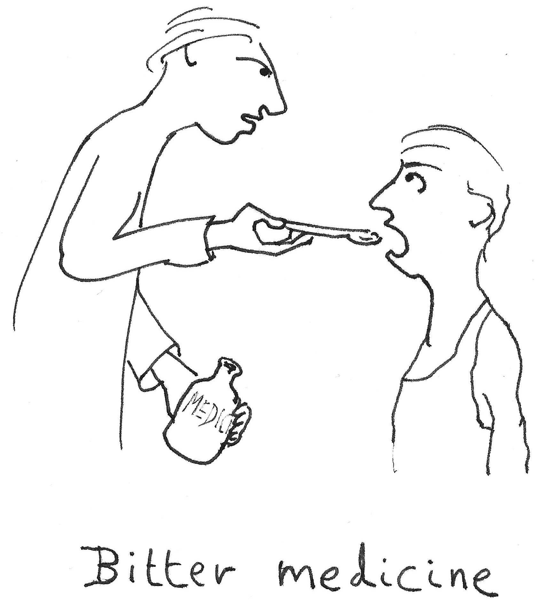

===============
Being unpopular
===============

..  rubric:: Being prepared to do difficult things

**Your work will make you unpopular at least sometimes, with at least some people.** You cannot avoid it, and you shouldn't even be averse to it.

If you never do anything that other people don't like, you are probably not doing anything at all.

In order to do your job properly, doing real work that makes a difference, sometimes you will have to go forward with something that other people object to. You will sometimes **choose directions, make decisions, propose actions, make judgements and come to conclusions** that have real negative consequences for other people, and you need to accept that.

What's merely unpopular and what actually hurts
===============================================

It helps to spend a little time understanding what we are dealing with. The first thing to note is that people object to different kinds of things, and not all objections are the same:

.. list-table::
    :header-rows: 1
    :widths: 50 50   

    * - things people merely dislike
      - things that really do hurt
    * - being shaken out of comfortable patterns

        being asked to change their complacent ways
    
        being challenged to improve
      - working situations that conflict with their values

        seeing their accomplishments or ambitions dismantled

        losing a position

They are not the same! *Someone suffering genuine pain is in far more need of our consideration than someone suffering things they merely dislike.*

Unfortunately it's very hard for you - as an observer - to distinguish, in any useful objective or reliable way, what people don't like from what's going to hurt them.

Even worse, when dealing with people's objections to our actions and proposals, there is a risk of mistaking things that would actually harm them for things they merely dislike.

This means that to be safe, and even though these things are in fact quite different from each other, **you need to start from the assumption that things people don't like are in fact hurting them**. Only later can you afford to make the judgement that someone is suffering a mere dislike, and you'd better do it carefully.

Wants, needs and truth
======================

Believing that you, unlike the vast majority of other people, can distinguish between *what other people don't like* (their mere preferences) from *what will really hurt them* (their unmet needs) puts you into a position in which you're likely not even to notice their needs.

.. Admonition:: Why this happens

    What happens in essence is this:

    I have a fundamental *need*, which if not met, represents a genuine hurt. I find it difficult to express it as a need, so instead I construct an edifice of *argument and justification*, and present it to you as a claim that demands the assent of any reasonable person. You reject the claim as an expression of *mere preference* that's falsely wearing clothes of truth and objectivity.

    That is, a need becomes expressed in the language of right and wrong, and then heard (and therefore dismissed) as a mere want.
    
    *This is a near-universal pattern.*

    The key elements are: people's general inability to express their own needs, and their general tendency to demote other people's claims to the status of mere preference.
    
    Put together, they mean that **we are all at almost permanent risk of failing to recognise other people's needs**.

**This is a very risky position to put yourself in as a leader.** Almost nothing is guaranteed to cause more genuine unhappiness and damage than a sense of unrecognised need or concern. You can easily do more harm by failing to acknowledge a need, than by failing to meet it.

**You can't meet everyone's needs.** You may have to make decisions that advantages some people and disbenefit others, in real and material ways. But recognising needs as needs (even when they are expressed badly) helps ensure that you do meet as many as possible, and makes it easier for people to accept when you don't meet them.

Taking responsibility
=====================

You can't be held responsible for not meeting all needs, because that's impossible anyway. 

However, you are responsible for deciding whose needs you will meet and whose you will not - and it's important to take responsibility for that. Be forthright about what it is that you are doing. If the decision is yours, own it. If you have the slightest suspicion that what you are doing runs counter to someone's need, address that. Don't downgrade it to a mere want, or worse, turn it into a rejected argument.

.. list-table::
    :header-rows: 1
    :widths: 50 50   

    * - Taking responsibility
      - Evading responsibility
    * - I had to make a decision and I decided ...
      - I had no choice but to...
    * - I decided that ...
      - We felt that ...
    * - I know you wanted x because you need y, but I have decided to go for z.
      - I know you argued for x, but y is a better choice.

It's hard to look someone in the eye, acknowledge a need, and tell them that you have decided you will not meet it. When the time comes that you have to do it, do it.

On feelings
===========

**People's feelings don't matter because they're right, they matter because they are feelings, and feelings nearly always represent needs.** 

You might prefer to deal with matters of truth and right than with feelings. Even if you do, you will still find that what requires the greatest care to navigate are people's feelings.

This can be hard to swallow, especially in the case where we are dealing with things like technical decisions or business judgements, where it seems that it *ought* to be argument, justification, rationality, evidence and truth that we turn to.

However, all these things still belong to people. **Everything that people think, say and do is thoroughly coloured by and invested with their feelings.**

That's just how things are; as a realist, you need to recognise and learn to deal with it whether you like it or not. There is absolutely no point in trying to change it either. 

This doesn't mean that everyone's feelings are always right or that we should be governed by them. It doesn't mean that truth or reason should be subordinated to feeling. It means that **being successful requires paying attention to feelings, because of what they represent**.

Being unpopular without causing damage
======================================

When you decide to say or do something that someone really doesn't like, possibly something that a lot of people don't like - even causes genuine pain, all you can do is try to do it with integrity and compassion.

You must recognise when what you're saying or doing is going to be unpopular, and acknowledge it explicitly. Nobody will feel better about it if you keep quiet. At the same time you don't need to fear that being explicit about it will make it any more unpopular.

It's hard for people to accept unpopular, painful things, and especially so if the person administering the pain appears not to understand that it's painful.  

It's not the unpopularity of what you need to do that's the issue, it's how people see *you*. Essentially, it's a matter of trust. If you are trusted, people will be willing to accept quite bitter medicine, even though they don't like it.

You can't meet everyone's needs. But recognising needs as needs (even when they are expressed badly) helps ensure that you do meet as many as possible, and makes it easier for people to accept when you don't meet them.

When to be unpopular
=====================

It's pretty foolish to try doing something unpopular until you've earned some trust. It has to come after you've demonstrated your ability to listen and understand, and recognise people's needs.
