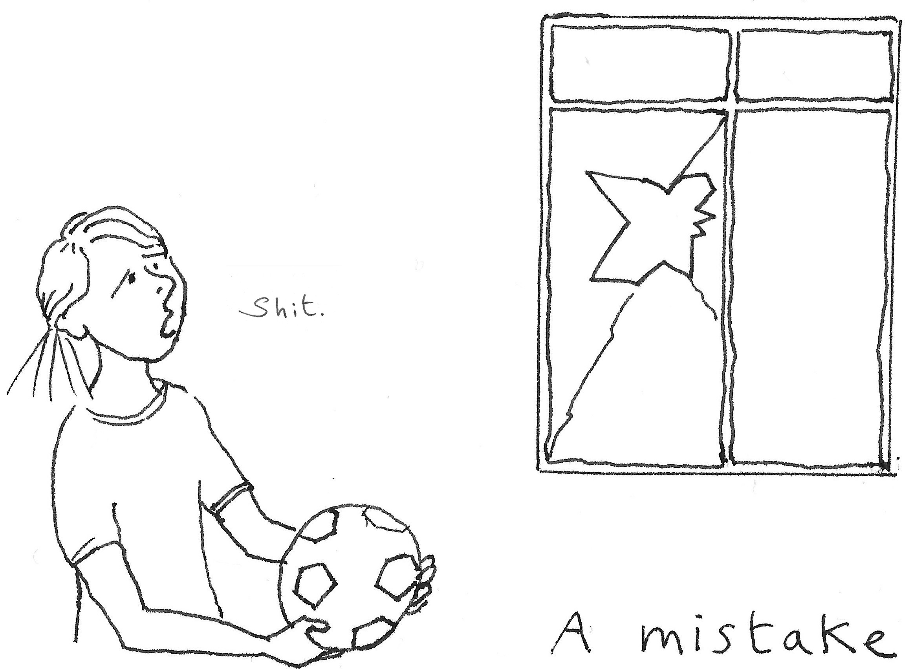

===============
Making mistakes
===============

..  rubric:: Recovering from blunders

As a practice lead, your work is forwards, into new territory. **If you never make a mistake, you're not trying hard enough.** You're almost certainly not doing your job of redefining practice in the organisation, or doing anything new.

This puts you in an odd position, because every *particular* mistake you make is something that you shouldn't have done and shouldn't have happened, and at the same time *development, progress and success depend upon mistake-making*.

You will have to learn to live with that.

..  admonition:: What a mistake is and isn't

    A mistake is an error of judgement, being carried away by enthusiasm for an idea, misreading a situation, misjudging an effect. A mistake is when you act towards a certain outcome, but get it wrong and achieve something unwanted. 

    Unfortunately the word *mistake* is rather overused. Dishonesty, abusing power, deliberately harming someone else, subverting due process - those aren't "mistakes", and you'll need more than this handbook can offer if that's where you find yourself.

Basic workflow
==============

There is a tried and tested workflow for successful mistake-making:

* Have a good idea.
* Consider it thoughtfully and sincerely.
* Act, and commit your mistake.
* Realise it was a mistake.
* Own it as whole-heartedly as you would own a success, and apologise honestly. 
* Put right what it's possible to put right.
* Learn from it.

You need all these steps, in the right order, to make a successful mistake.

Realising you've made a mistake
===============================

**There is an absolutely guaranteed way to know when you've made a mistake.** It's when other people tell you: "You've made a mistake".

On the other hand, just because nobody tells you that you have made a mistake doesn't mean that you haven't.

A wise person will recognise the signs that accompany their own mistake-making. For example, you might have a distinct feeling of urgent enthusiasm about doing something new, and be self-aware enough to know that's how you feel when you're just about to leap into something that turns out to be a mistake. If you're lucky, you'll recognise this feeling *before* you make your mistakes, not just afterwards.

Nearly everybody realises when they have made a mistake - eventually. If you can't spot a mistake before you make it, at least try to do it as quickly as possible afterwards.

Owning and apologising for your mistake
=======================================

Draw a circle around your mistake, so that everybody, including you, sees it as truly yours and yours alone. There is hardly anything more depressing than a partly-owned mistake.
An apology for a mistake contains:

* a statement: *I did x*.
* a recognition of the problem: *I shouldn't have done that*.
* an expression of remorse: *I am sorry for having done it*.

**The apology should only look backwards at your mistake.** Wanting to help put things right is important, and having made a mistake, it's something people need to hear from you. However, it's not part of an apology itself. It comes afterwards. Save it for then. 

As a sincere person making a well-intentioned mistake, it's natural to feel an almost irresistible urge to explain, and to reassure that you had good intentions. It's also completely unhelpful. *If* you're asked to explain, or what your intentions were, then you can talk about them.

As a reasonable and responsible person, you almost certainly made the mistake feeling it was the right thing to do. But, justifications are similarly unwanted at this moment (unless you are specifically asked to provide them).

So apologies **do not**:

* contain explanations: *I was in a hurry and thought...*
* describe intentions: *I meant to...*
* contain justifications: *I thought it was OK because...*

Qualifying an apology or transferring responsibility are never attractive things to do. This makes it an offensive anti-apology:

* qualifications: *I am sorry if...*
* transferring responsibility to someone else: *I am sorry that you feel...*

Getting over it
===============

It's always a bad experience to make a mistake. You are not going to enjoy it. 
If your mistake was an annoying one, expect people to be annoyed, and to complain about it. Depending on the severity or stupidity of the mistake, you may wish to spend a little time with your head down.

However (when done correctly) mistakes are very forgivable things and people have an immense capacity to forgive them. How you behave afterwards will be remembered much longer than the actual mistake. In general you really need to make a monstrous blunder to have it held against you.

Mistakes of omission
====================

The reality is that you are going to worry over mistakes you might make, may have made and actually did make, and all the while **the really significant mistakes will be the things you did not do**. 

In most cases, you won't even have the signal of other people's objections. Quite possibly you will make the most serious errors of omission and never even realise that you did until much later.

These are the mistakes that will do the most damage to your project, silently.
