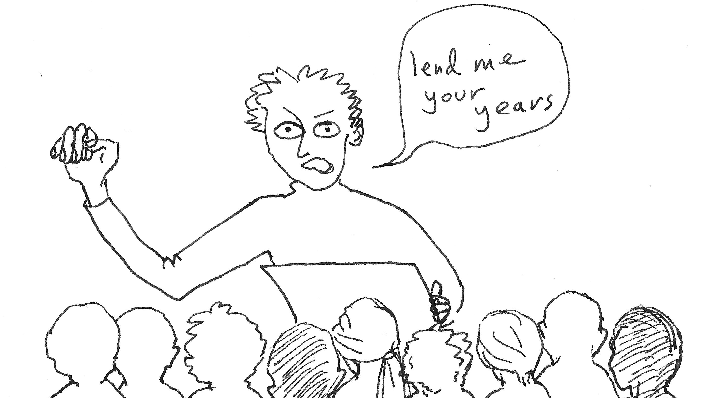
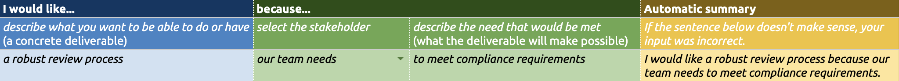

===================
Securing engagement
===================

..  rubric:: Having encounters that work

The previous sections are concerned with securing your colleagues' assent for you and your vision. That is hard enough, but easy compared to what you must do now: actually get them to work with you. 

This will happen in a series of different encounters with them - presentations, introductions, conversations, training workshops, exercises.

For this to be successful *they* must give *you* their attention, commitment, participation and time. At this point your assertion of authority moves out from the realm of ideas into that of action. If you don't make this work, you are guaranteed not to succeed.

Be prepared to ask for people's time
====================================

Don't wait shyly to be invited to an introduction or to present your plans. You **must** assert the value of your work, to everyone, by *requiring* the time and attention of your colleagues.

You cannot possibly do your work without taking people's time - quite significant quantities of their time - so get used to asking for it.

    Significant quantities of their time

If you don't - if you make it optional or leave this to their discretion - then you are telling everyone that your work, your job and *you* are optional to the success of the company.

You're the practice leader. **It is up to you to initiate these encounters**, to set the agenda and the pace, to decide which of your colleagues need to participate in which activities with you, **to work your way methodically through the company with your demands on people's time**.
     
Is everyone with you?
=====================

You need to understand what you are dealing with. Ideally, everyone:

* agrees that there is a problem or need in your domain
* believes that what you're proposing will help us do better
* believes that you are the person to lead the work
* believes that their actions will make a difference
* is willing to take part to help make it better

You'll probably find that at the top of this list more people are with you, but that you tend to lose them as you go down. *Don't waste time trying to address the wrong gap.*

`Workbook - is everyone with you? <https://docs.google.com/document/d/18_OOHIZJ8SQASDjdrtgU9TzLSZDl0fa91eGfHQsODM4/edit#heading=h.x3ruvmgkh5aw>`_

Needs, values and motivations
-----------------------------

Keeping people with you requires having needs, values and motivations in common. You also need to **keep reminding people of them**. Keep them at the forefront. In each encounter; identify them and name them, repeatedly. 

When other people invoke them, acknowledge it explicitly. Invoke them yourself in conversations if other people don't do it first.

.. _making-encounters-work:

Making encounters work
======================

For every encounter you set up, **be explicit, in advance, to set expectations**. Everyone (including you) needs clarity. 

Include them in meeting invitations, for example. Write down hoped-for outcomes in your notes so that they don't slip your mind in the midst of conversation.

.. _framing-encounters:

Attendees should be furnished with all this in advance: telling them in the first five minutes is too late. Let them join already primed to participate in the way you need, by framing the encounter according to purpose, outcome and activity .

Frame encounters, for yourself and the other parties, according to **purpose**, **outcome** and **activity**.

Purpose
------- 

*Why are we spending our valuable time doing this?*

* "I'd like to understand how your team handles x." 
* "We need to check that we're aligned with your plans for y."

Be empathetic - it can be very unsettling to be invited to a meeting without knowing why, especially for a more junior person. Don't assume it's obvious.

Outcome 
--------

*What shall this this encounter achieve?* 

* "I want to indentify our top three priorities for x."
* "After this workshop, you'll be ready for y."
* "I'd like to introduce myself."

What concrete things do you hope you will have agreed, what will someone have learned, what will you have accomplished by the time it's over?

Activity
--------

*What are the participants going to do in this session?*

In particular, be clear about which direction you expect the knowledge, understanding and insight to flow. In different cases, it will be:

* almost entirely from you to them (e.g. presentations)
* bidirectional (e.g. introductions, conversations, exploratory exercises, teaching workshops)
* almost entirely from them to you (e.g. a listening exercise)

It's not helpful if everyone else turns up to a call in polite listening mode when you were hoping to hear from them, or vice-versa.

Effective engagement activities
=====================================

Presentations
-------------

You should have (or find, or make) the opportunity to introduce yourself and your vision, and later present the progress of your work.

A good approach to preparing a presentation is not to think about what you want to say, but **what you want people to think**, what you want to be different as a result of their having heard you. What you say is a means to that end.

A presentation is a demand on other people's time. Depending on the circumstances, you might be demanding hundreds of hours of people-time. **You have a strong obligation to make it worth it.** Take the time proudly and without any apology, because doing that is a good way of asserting the importance of what you say, but make every minute of that time repay what the audience has given you.

Introductions and conversations
-------------------------------

Relationships, including working relationships, start with **introductions**. You can set the tone and expectations of those relationships by making a point of introducing yourself in one-to-one calls with everyone you expect to work with and whose support you will need.

An introduction is just that; it's not a business meeting at which you plunge straight into work.

**Conversations** about work, with individuals or groups of individuals, can easily become inconsequential if they are not framed well. :ref:`Framing encounters <framing-encounters>` helps make even open-ended conversations productive (if people come primed to talk, and you're listening well, you'll often hear something useful).

..  admonition:: Example from documentation practice

    For my first three or so months at Canonical, I needed to listen before being in a position to do things, or ask people to do things. 

    During that time I had over 200 conversations with different individuals and groups of people. Some were simply introductory calls, for example with other engineering directors; others were more directed conversations to learn about the needs of different teams and the circumstances they find themselves in.

    I held these calls in different phases, in order to build up a picture from several different perspectives:

    * engineering directors
    * engineering managers
    * people in other parts of the organisation (support, sales, field engineering)
    * product managers

    I usually asked whom they'd recommend I should speak to next; the advice was often surprising. It took me on a random walk through the organisation, and gave me valuable introductions to people, and documentation-related matters, that I might otherwise not have encountered.

    Of these calls perhaps as many as half were rather inconclusive, but I was prepared for that. In many cases someone came back to me some time later to pick up the conversation, wanting to talk about something more concrete - which wouldn't have happened if not for the earlier introduction. 

Workshops
---------

"Workshop" can mean almost anything. Most of the so-called workshops that people find themselves signing up for really are not anything of the sort. A workshop worth the name is a structured, interactive, collaborative engagement, directed towards a clear outcome.

The key part of a workshop is the activies that you get your participants to do, and not the part where you speak and they listen to your wisdom.

..  admonition:: Example from documentation practice

    I need everyone working with documentation to have a good grasp of the standards and practices I want to be adopted. 

    Within two weeks of joining, I started running regular documentation training workshops. At least half of each session is dedicated to interactive exercises, discussion of theory and practice, and considering actual examples at Canonical.

    **I set expectations** - I made it clear from my first introduction that I expected everyone working with documentation or with responsibility for it to attend the workshops. I repeated this whenever announcing a new set of workshops, using channels such as email lists and Mattermost, and mentioning it to people in conversation. I used the lists of new joiners each month to let relevant people know as well. 

    Within a short time, hundreds of colleagues have attended a documentation workshop.

    **I made sure I was providing value** - Asking for so such time so many people is a lot, so I put a great deal of effort into preparing and executing the workshops. They have been developed and refined over several years. It's material that has genuine value for attendees and their professional development, and needs to feel that way to them. 

Listening and discovery activities
----------------------------------

**You must know what people need, but they are probably not going to tell you.**

You will hear and see people's needs if you are alert, but sometimes you will want to draw this out of them in a more structured way. For example, you may want answers to questions like *How can I help you in your work?* or *Is there something that you need from me?* 

The problem is that in general, **people are not good at asking for what they want or describing what they need**. Instead, they tend to try to talk about *what ought to be the case*, and frame their needs in argument and justification (not even good argument or justification). This is because they have been conditioned to regard wants and needs as less respectable than argument and justification.

A wants/needs exercise
~~~~~~~~~~~~~~~~~~~~~~

In order to discover needs, you may need to take control of the discourse, to insist on the expression of what you are looking for. This can be very hard work, and it helps to have tools that do some this work for you.

The `Wants and needs spreadsheet <https://docs.google.com/spreadsheets/d/12IYRIiN5rsYlmjCYZca42ef2o6TTp9CnPYfEVmh7lYU/edit?usp=sharing>`_ is an example of this. 

It obliges participants to express wants as needs in a highly-structured way, by providing a form for their expression.

This exercise works effectively because it obliges people to think and speak concretely (genuine wants are concrete deliverables), and to connect wants to something deeper (needs). At the same time, it separates wants from needs, and makes it easier to consider other ways of meeting the same needs. 

It removes justification and argument from the conversation - you can't argue with people's wants or needs, and people don't need to defend them - making discovery faster and less obscured by unhelpful arguing and position-taking.

The result is an effective picture of how you can help colleagues, and the needs and gaps that affect their work.

The spreadsheet produces statements like:

* "I would like better on-boarding documentation because our team needs to bring in new team members efficiently."
* "I would like us to have a good introductory tutorial for the product because Canonical needs potential commercial customers to obtain success quickly when evaluating it."
* "I would like us to have a security review process for documentation contributions because our users need assurances about security standards in the product."
* "I would like a way to recognise contributions to our documentation because our community users need to feel valued."

`Workbook - effective engagement activities <https://docs.google.com/document/d/18_OOHIZJ8SQASDjdrtgU9TzLSZDl0fa91eGfHQsODM4/edit>`_

Speaking widely and working narrowly
====================================

Speak widely
------------

Even if they are not involved in it, everyone needs to hear about your programme. They must hear your ideas and ambitions, and about what is being achieved, and **they must feel that it includes them**. Use the language of "We are..." (*we are doing this*, *we are aiming for that*, *we are exploring this*, etc).

Sharing activities and achievements
~~~~~~~~~~~~~~~~~~~~~~~~~~~~~~~~~~~

It's valuable to keep a record of and share activities, even modest ones, once real work is underway under your direction ("this week: the xxx team changed yyy in their implementation of zzz", "so-and-so presented the programme to their team", etc).

This communication should be regular, not sporadic. It will only be regular if you budget time and effort for it.

Speaking to the outside world
~~~~~~~~~~~~~~~~~~~~~~~~~~~~~

It makes sense for an open-source software company to **be publicly open** about some of these things too. It's valuable in itself, but it also reflects back within the company, on the work you are doing - it's a signal to colleagues that the work is of real significance.

The `Ubuntu weblog <https://ubuntu.com/blog>`_ is at your disposal, for example.

Work narrowly
-------------

It's important to speak widely, but **you cannot work widely**. Your work must be narrowly-focused. 

True engagement requires actual, concrete contact. The focus should be to accomplish some particular thing, and then another, and then another. One visible milestone is worth much more than an effort thinly-spread across the whole organisation, that nobody can even see.

The first moment of enlightenment for someone who is not already invested in your project will come when they see a concrete example of success in front of them. Take a note of these instances - you can rely on them to show you which of your successes will make the greatest impression on others whose engagement you need to secure.

`Workbook - work narrowly <https://docs.google.com/document/d/18_OOHIZJ8SQASDjdrtgU9TzLSZDl0fa91eGfHQsODM4/edit#heading=h.dakiz6tyhqxy>`_

Make it visible
===============

**Do your work in the open.** What you do, what teams and colleagues do because of you, and what's achieved should all be visible - not just visible, but easily seen.

You need to find ways to put in systems and establish practices that make this happen as automatically as possible. As a start, look at all the different ways in which you learn about progress and innovation in other parts of the organisation, and simply copy them. They will work for you too. Later you can find new ways of your own.

`Workbook - making work visible <https://docs.google.com/document/d/18_OOHIZJ8SQASDjdrtgU9TzLSZDl0fa91eGfHQsODM4/edit#heading=h.t8smgz2n3f5w>`_

How to recruit participants
===========================

You need to be able to recruit volunteers (individuals and teams), support for proposals, participants in exercises etc.

There are fundamentally three ways in which you can go about this.

Open up the opportunity
-----------------------

Ask widely: "Can you help with...?" "Would anyone like to...?" "Does anyone need...?"

This can sometimes work, and it often feels like the politest and most considerate way to put something in front of hundreds of busy people. However for this to work, what you are offering needs to be something that these people *already see themselves as needing*. 

**It will probably not work well for you at the beginning of your programme. I do not recommend it.**

Choose the volunteers/recipients/participants
---------------------------------------------

Just tell people: "I choose *you* to take part in the experiment". 

This can also work, and sometimes you need will to do it. But, you have to be very confident that you can command people's involvement in this way, and that's not often guaranteed - especially in your early days.

Make direct requests
--------------------

Something that takes more effort at first, but is a safer and generally more successful approach is to make **a direct, targeted request**.

For example: "I need to find three teams to pilot xxx, and I would like yours to be one of them, because it seems like a good fit. Would you be willing to discuss the implications to see if it would work?" or: "I need to get some better information about how yyy works, and I think your team would be the source of the best data for me. Do you think we could look at this in some detail?"

This approach makes a very specific request for them, not to *do* something, but to *consider their willingness* to do something. Only a rare person will refuse even to consider something. It's also explicit about the next step (to discuss, to look at, whatever) - which is always modest. 

Express your needs
~~~~~~~~~~~~~~~~~~

Strangely, people will often respond to something that starts with *your needs* more eagerly than to something that is about *their needs*. 

**The words "I need" are very powerful ones in any language.** People respect them.

Once you've started doing this, you will be amazed how normal it becomes for you to ask other people to do things.

When recruiting people, always try to use the :ref:`purpose/outcome/activity structure <framing-encounters>` to set out your request. 
