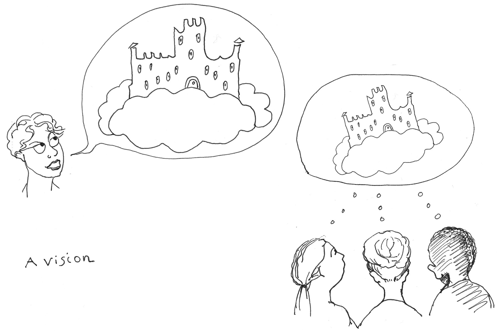

===================
Sharing your vision
===================

.. rubric:: From a picture inside your head to one that everyone sees

This section is intended to help you communicate it, in a structured and systematic way.

Your first task
===============

Your immediate task is to share that vision with all the company, in a concrete and vivid way (and in a way that you can repeat as many times as necessary without becoming sick of it yourself).

People may be unready to absorb your vision for your domain. But, the real challenge will be that for many of them, the idea that anyone might be visionary about something like security or documentation will be a surprise.

Some will be quite alarmed that you have a vision that has implications for *them*. They probably thought that these things were somebody else's problem. Now you are making it their problem. They will likely want to resist that.

You will find that quite a lot of people imagine your domain as the stuff of dully-functional common-sense, that anyone could take care of with a little effort. So, at the same time as sharing your vision, you're going to have to show that the problems actually need a visionary solution.

It's not enough to have a clear vision; your description of it will need to be persuasive and compelling.

Successful communication
========================

There are good and bad ways to communicate a vision with other people.

A technocratic blunder
------------------------

At this stage, before you have been able to engage people in concrete activity, the true meaning of what you plan for them will not be apparent to them. The technocrat in you - the precision-minded, close-focused expert - may be tempted to address that by furnishing them with detail. Resist that that temptation: **more detail will not help get the significance of your project across to them**. On the contrary, it's a classic technocratic blunder that will hobble your own message.

You're going to have to find other ways of getting your meaning across.

The success of the strategy that serves your vision will lie in the rigour and intelligence with which you define it. Your credibility will depend upon your ability to articulate it with precision and expert insight - **but that will not help you get it across to other people**.

This is such a counter-intuitive truth that it bears repeating. *What gives your vision value, and what makes your strategy strong, are not what you will need to draw upon in order to share them successfully with others.*

To reach people effectively you will need to make use of two communications devices: *resonant metaphors*, and *concrete talk*:

Resonant metaphors
------------------

**Your vision needs to leap a gap, like a spark.** It needs something to carry it across - metaphors and ideas, that are strong enough to do that work for you. It is very hard for people to build their own image of something out of its details (even if they positively want to, and that's not something you can count on). The more precise detail you give them, the harder it is for them to form the big picture, and the more things that sceptics will fixate on and doubters will worry about.

Instead you will need to give them something that can stand up on its own, that seizes the imagination, and meaningfully captures what's important in what you want to get across.

..  admonition:: Example from documentation practice

    To introduce the ideas of excellence of *direction*, *discipline*, *execution* and *tooling* in documentation, I chose a metaphor of cycling in the mountains. All four of them equally well to a successful bicycle trip.

    The metaphor is strong and resonant enough to carry something across to the audience.

`Workbook - metaphors <https://docs.google.com/document/d/18_OOHIZJ8SQASDjdrtgU9TzLSZDl0fa91eGfHQsODM4/edit#heading=h.vaxdu0rnal5n>`_

Rigorous thinking, concrete talk
--------------------------------

**Your audience will build their own understanding out of the concrete, tangible things you give them to grasp** - not out of high-level, abstract description.

What is it going to be like for the people who'll need to work with your vision? People require a real and immediate sense of what it's going to mean for them, for each of the strands in your strategy.

What are the material implications of your idea of - for example - "execution"? Or, what are the actual tools that you think can help fulfil your vision? You need to be able to provide descriptions and answers that allow people to understand them at a concrete level.

At the same time, you need rigorous thinking. Your concrete examples need a theoretical underpinning. At the very least, what you are offering needs to look like something that people can believe in, a coherent and reasonably complete package of thought.

**In communicating ideas, experts tend to undervalue and underestimate the power and effectiveness of concrete talk.** They under-use it, and use it weakly.

That concrete talk is what is going to get your vision across to other people, who are not already at your level of thinking about the topic. They will only appreciate the theoretical underpinning of your work *through* the concrete communication that you can offer them.

You're an expert, so you already have the rigorous thinking. But, it's quite likely that you will be better at communicating about that than you are at speaking in concrete ways - so you will need to practice the latter.

..  admonition:: Example from documentation practice

    For documentation, in the earliest possible conversations with engineering teams, I presented them with concrete examples of what the documentation prioject would mean for them:

        The home page of your product documentation needs to look like *this*.

    or:

        I need you to adopt *this* specific practice.

    and best of all:

        Let's change xxx, *right now*, so that it does yyy."

`Workbook - concrete talk <https://docs.google.com/document/d/18_OOHIZJ8SQASDjdrtgU9TzLSZDl0fa91eGfHQsODM4/edit#heading=h.vtrg0yugarhx>`_

Delivering the message
======================

**There is no such thing as timid leadership.**

Having a message of outstanding clarity that conveys persuasive, compelling vision is not enough - **you have to deliver the message too**, actually put it in front of people. You can't do this apologetically or hesitantly, wondering whether it's appropriate for you to demand their attention, or finding ways to put the message out there so that people come across it.

Authority is claimed as much as it is granted. The authority of your position will be marked by the very first time you address the organisation. Will it be tentatively, timidly, to small audiences? Or will you require the attention of the organisation as a whole to hear what *you* have to say, because *they* need to hear it?

As a practice lead, you are not just entitled to claim that authority, but obliged to. Tthe worst thing you can do with authority is to abuse it, and the second-worst thing is to squander it.

**If you don't believe and assert with confidence that the organisation needs to hear your message, coming from you, about your vision - then nobody else will believe it either.**

..  admonition:: Example from documentation practice

    I asked for a plenary slot to introduce myself at the first (virtual, because it was during the pandemic) sprint I attended, two weeks after I started, and at all subsequent events.

    A little later I published a kind of manifesto on the Canonical weblog: `The future of documentation at Canonical <https://canonical.com/blog/the-future-of-documentation-at-canonical>`_, and followed that up with a set of pages occupying a prime spot at https://canonical.com/documentation.

`Workbook - delivering your message <https://docs.google.com/document/d/18_OOHIZJ8SQASDjdrtgU9TzLSZDl0fa91eGfHQsODM4/edit#heading=h.akr76wc57jfd>`_

Resources to keep your message alive
====================================

It's not until your vision has started to be expressed and experienced in concrete ways - in actual work - that it will actually be assimilated.

Until then, all you can do is keep repeating it, to keep it in people's minds.

How you present your ideas within the company and without is up to you, but you will need to be able to express your vision at different levels of detail, to different audiences, and in different ways. You'll find yourself required to do it over and over again, in conversations; even in conversations *with the same people*.

It will seem sometimes that you have to do it endlessly, especially if your vision is new to the company. *You will be amazed how much you have to repeat yourself.*

There is no way around that - but you can help yourself by developing a battery of resources to do some of this work for you, that all convey the same messages in different forms - presentations, weblog articles, conference talks, images, slogans - reminders of one kind or another that repeat the message.

All these things need to be *forcefulful and unapologetic*. They need to reinforce what you say, not dilute it.

`Workbook - resources to carry your message <https://docs.google.com/document/d/18_OOHIZJ8SQASDjdrtgU9TzLSZDl0fa91eGfHQsODM4/edit?tab=t.0#heading=h.1f4pxjep7i2p>`_
